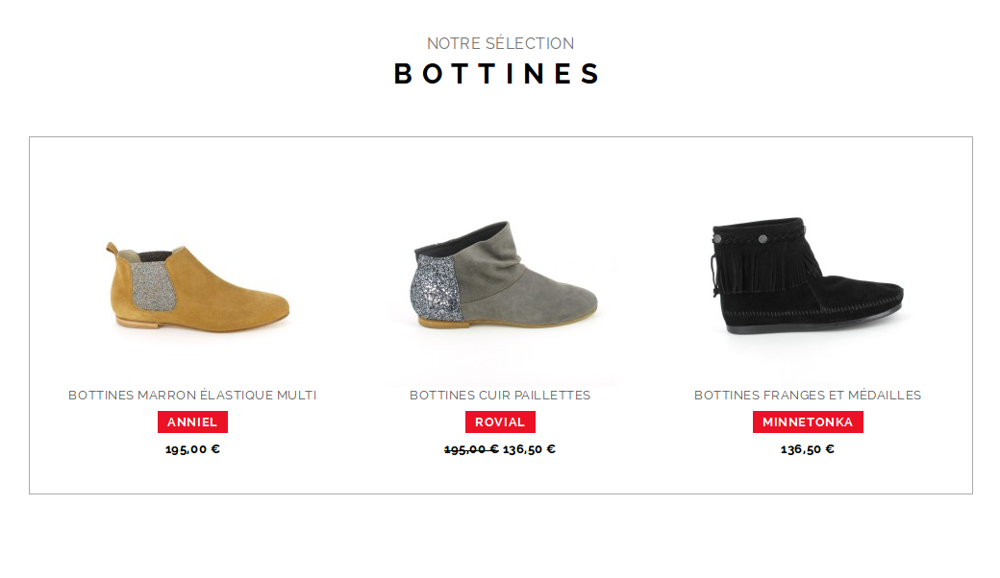
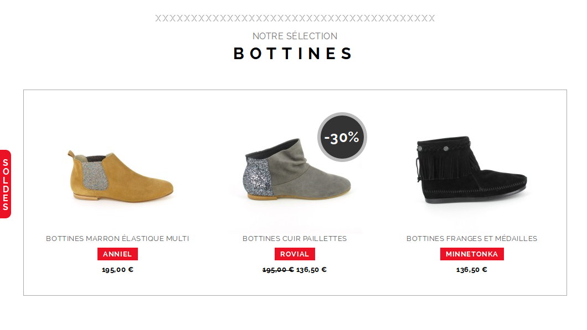

# Projet Boutique

## Objectif
Concevoir la page 'sélection' de la boutique

## Instructions

- Réaliser l'intégration comme présentée dans le fichier `rendu/rendu-selection.png`
- La font utilisée est `Raleway`, elle est disponible sur Google Fonts
- Au survol de chaque produit, un cadre gris de 1px doit apparaître autour
- Chaque produit est un lien vers une future page produit

## Bonus

- Réaliser l'intégration comme présentée dans le fichier `rendu/rendu-soldes.png`
- L'étiquette `soldes` doit se trouver exactement au centre de l'écran, quelque soit la hauteur de la fenêtre
